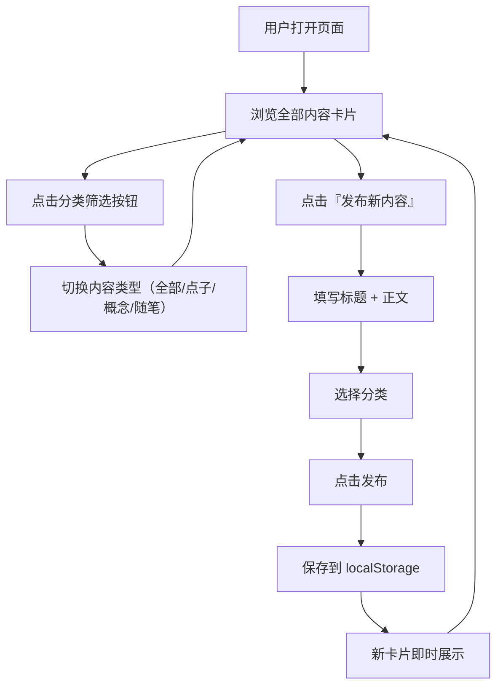

## 1. 产品概述

深空构想是一个极简轻量化的科幻创意分享与讨论平台，专门用来记录、存放、展示和讨论科幻点子、科幻概念及科幻随笔。面向科幻爱好者、写作者和创意工作者，提供一个干净、安静、沉浸式的个人与轻社区自留地。

- 核心痛点：科幻爱好者缺少一个专门承载科幻灵感与思考的极简平台，现有平台过于复杂或缺乏科幻调性
- 目标用户：科幻创作者、科幻爱好者、脑洞收藏者、文艺科幻读者

## 2. 核心功能

### 2.1 用户角色
| 角色 | 使用方式 | 核心权限 |
|------|----------|----------|
| 访客/创作者 | 直接访问网页 | 发布内容、浏览内容、分类筛选 |

### 2.2 功能模块

1. **内容发布**：发布科幻点子/概念/随笔，填写标题+正文+选择分类，本地存储不丢失
2. **内容浏览**：瀑布流/网格卡片展示，所有内容一目了然
3. **分类筛选**：一键切换只看点子/只看概念/只看随笔
4. **内容管理**：新增内容，后续可扩展删除和编辑功能

### 2.3 页面详情

| 页面名称 | 模块名称 | 功能说明 |
|----------|----------|----------|
| 首页 | 顶栏/导航 | 网站名称"深空构想"、分类筛选按钮（全部/点子/概念/随笔） |
| 首页 | 内容发布区 | 表单区域：标题输入、正文输入（textarea）、分类选择、发布按钮 |
| 首页 | 内容列表 | 卡片网格展示所有已发布内容，每张卡片包含分类标签、标题、正文摘要、发布时间 |
| 首页 | 空状态提示 | 当某分类无内容时显示友好的空状态提示 |

## 3. 核心流程

用户打开页面 → 浏览所有科幻内容卡片 → 点击分类筛选按钮切换内容类型 → 点击"发布新内容"展开表单 → 填写标题和正文 → 选择分类（点子/概念/随笔） → 点击发布 → 内容保存到本地存储 → 新卡片即时出现在列表中 → 刷新页面内容不丢失

## 4. 用户界面设计

### 4.1 设计风格

- **主色调**：深空黑 (#0a0e17) + 星云浅蓝 (#7ec8e3) + 微弱金光 (#c9a84c)
- **辅助色**：深蓝灰 (#141b2b)、浅灰文字 (#b8c6d4)、发光边框色 (rgba(126, 200, 227, 0.3))
- **按钮风格**：细边框发光，悬停渐变，微妙的发光动效
- **字体**：英文字体使用 'JetBrains Mono' 或 'Space Grotesk' 体现科技感，中文字体使用系统无衬线体
- **布局风格**：卡片式布局，顶部导航固定，内容区居中最大宽度 1200px
- **图标风格**：简洁线条式图标或纯文本标签

### 4.2 页面设计概览

| 页面名称 | 模块名称 | UI元素说明 |
|----------|----------|------------|
| 首页 | 顶部导航 | 左侧"深空构想"logo文字（星云浅蓝+发光），右侧分类筛选按钮组（发光边框胶囊按钮） |
| 首页 | 发布区域 | 可收起/展开的面板，输入框深色背景+发光聚焦边框，分类下拉/选择按钮科幻风格，发布按钮金色渐变 |
| 首页 | 内容卡片 | 深色卡片背景+细科幻发光边框，hover时边框亮度提升+卡片轻微上浮，左上角分类标签（颜色区分），标题浅色粗体，正文摘要半透明，底部时间戳 |
| 首页 | 空状态 | 中央显示一行科幻风格的提示文字+微弱星光动效 |

### 4.3 响应式设计

- 桌面优先设计，最大内容宽度 1200px
- 平板（768px+）：卡片两列布局
- 手机（＜768px）：卡片单列布局，导航按钮折叠为可滚动行，发布表单全宽
- 触摸操作优化：按钮和卡片点击区域充足（≥44px）

### 4.4 动效设计

- 卡片入场：逐张淡入上浮（stagger 动画）
- 卡片悬浮：边框发光增强 + transform: translateY(-2px) + box-shadow 轻微扩散
- 按钮悬浮：背景色渐变 + 发光边框亮度变化
- 分类切换：内容区淡出/淡入过渡
- 发布成功：卡片插入时的平滑动画
- 背景：可选微弱的星空粒子效果（纯CSS或极简JS）