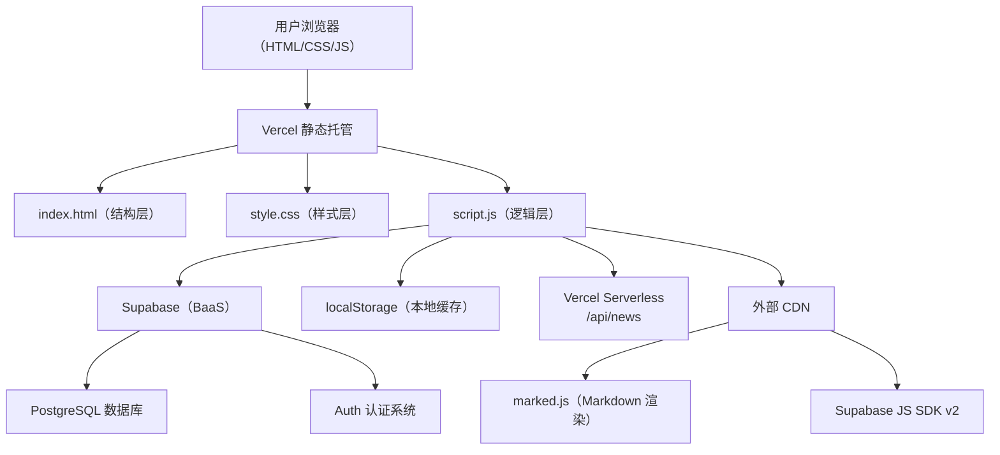

## 1. 架构设计

前端 SPA + BaaS 后端架构，前端负责 UI 渲染与交互，Supabase 负责数据存储、认证和实时同步。



## 2. 技术选型

| 技术 | 版本/使用方式 | 用途 |
|------|--------------|------|
| HTML5 | 原生 | 页面结构，语义化标签 |
| CSS3 | 原生（响应式 + 动画） | 科幻主题样式、明暗双主题、关键帧动画 |
| JavaScript ES6+ | 原生，无框架 | 全部业务逻辑 2754 行 |
| Supabase | BaaS（PostgreSQL + Auth + REST） | 数据持久化、用户认证、CRUD |
| Vercel | 静态托管 + Serverless Function | 部署、托管、RSS 资讯聚合 |
| marked.js | CDN (defer) | Markdown → HTML 渲染 |
| Supabase JS SDK v2 | CDN (async) | 客户端与 Supabase 通信 |
| Google Fonts | JetBrains Mono + Noto Sans SC | 英文字体（科技感）+ 中文字体 |
| Git LFS | 大型文件存储 | 背景音乐（~28MB MP3） |

## 3. 文件结构

```
/
├── index.html            # 主页面（完整 DOM 结构）
├── style.css             # 全部样式（~3681 行，25+ 模块，18 个 @keyframes）
├── script.js             # 全部逻辑（~2754 行，80+ 函数）
├── .trae/
│   ├── documents/
│   │   ├── PRD-深空构想.md
│   │   └── 技术架构-深空构想.md
│   └── skills/
│       └── token-efficient-coder/
│           └── SKILL.md
├── audio/
│   └── bgm.mp3           # 背景音乐（~28MB，Git LFS 管理）
├── api/
│   └── news.js           # Vercel Serverless：RSS 资讯聚合
├── vercel.json            # Vercel 部署配置
├── .gitignore
└── .gitattributes
```

## 4. 数据库设计（Supabase PostgreSQL）

### 4.1 ideas 表 — 灵感内容

```sql
create table ideas (
  id          uuid primary key default gen_random_uuid(),
  title       text not null,
  content     text not null,
  category    text not null check (category in ('idea', 'concept', 'essay')),
  tags        text[] default '{}',
  author      uuid references profiles(id),
  created_at  timestamptz default now(),
  updated_at  timestamptz default now(),
  likes       int default 0,
  liked_by    uuid[] default '{}',
  views       int default 0
);
```

### 4.2 comments 表 — 评论

```sql
create table comments (
  id          uuid primary key default gen_random_uuid(),
  idea_id     uuid references ideas(id) on delete cascade,
  author      uuid references profiles(id),
  text        text not null,
  created_at  timestamptz default now(),
  likes       int default 0,
  liked_by    uuid[] default '{}'
);
```

### 4.3 replies 表 — 回复

```sql
create table replies (
  id          uuid primary key default gen_random_uuid(),
  comment_id  uuid references comments(id) on delete cascade,
  author      uuid references profiles(id),
  text        text not null,
  created_at  timestamptz default now(),
  likes       int default 0,
  liked_by    uuid[] default '{}'
);
```

### 4.4 profiles 表 — 用户资料

```sql
create table profiles (
  id          uuid primary key references auth.users(id) on delete cascade,
  nickname    text unique not null,
  email       text,
  avatar      text,
  favorites   uuid[] default '{}',
  created_at  timestamptz default now()
);
```

### 4.5 friends 表 — 好友关系

```sql
create table friends (
  id          uuid primary key default gen_random_uuid(),
  user_id     uuid references profiles(id) on delete cascade,
  friend_id   uuid references profiles(id) on delete cascade,
  status      text default 'pending' check (status in ('pending', 'accepted')),
  created_at  timestamptz default now(),
  unique(user_id, friend_id)
);
```

### 4.6 localStorage 缓存（前端）

| 键名 | 存储内容 | 用途 |
|------|---------|------|
| `manlin_theme` | `'light'` / `'dark'` | 主题偏好持久化 |
| `manlin_news` | `{ articles: [...], time: timestamp }` | 资讯离线降级缓存 |
| `musicPlaying` | `'true'` / `'false'` | 音乐播放状态 |
| `musicTime` | `string (seconds)` | 音乐播放进度位置 |

## 5. 数据流

```
用户操作
  → 事件监听器（DOMContentLoaded 集中注册，~70 个事件）
  → 业务函数（handleXxx）
  → Supabase CRUD（select / insert / update / delete）
  → 本地状态更新（ideas 数组 / currentUserProfile 等）
  → UI 重渲染（renderIdeas / updateUserUI / renderFriends 等）
```

### 5.1 认证流

```
注册：表单验证 → checkNicknameExists → supabase.auth.signUp → 创建 profiles 记录 → 更新 UI
登录：supabase.auth.signInWithPassword → 获取 profile（不存在则自动创建）→ 更新 UI
会话恢复：init() → sb.auth.getSession() → 恢复 currentUser → autoFixProfile → 加载数据
登出：supabase.auth.signOut() → 清空状态 → 更新 UI
```

### 5.2 数据加载流

```
init()
  → 加载主题（localStorage）
  → 初始化网络状态监听
  → 尝试恢复 Supabase 会话
  → sb.auth.onAuthStateChange 监听
  → loadIdeas()（异步）
    → 查询 ideas + comments + replies + profiles 五表关联
    → 组装完整树形数据结构
  → renderIdeas()
  → updateUserUI()
  → 恢复背景音乐（若上次在播放）
```

## 6. 前端架构分层

### 6.1 样式模块（style.css ~3681 行）

| 模块 | 行号范围 | 说明 |
|------|---------|------|
| CSS 变量与重置 | L1-88 | 全局变量（颜色/间距/字体/阴影）、reset |
| 星空背景 | L89-127 | flex/box-shadow 星点布局 |
| 容器/布局 | L128-165 | .container, .header, .header-inner |
| 按钮系统 | L166-575 | btn / btn-primary / btn-icon / btn-glow / btn-close / btn-logout / btn-random / btn-about / btn-sm / btn-upload-img / btn-refresh / btn-accept-request / btn-remove-friend（含重复定义问题） |
| 标签 | L576-599 | .tag-idea / .tag-concept / .tag-essay |
| 漂浮按钮 | L600-647 | 主题浮动、音乐浮动 |
| 表格/表单 | L648-1035 | 表单元素、输入框、禁用状态 |
| 内容卡片 | L1036-1255 | .idea-card（入场动画、悬浮、分类标签） |
| Modal 弹窗 | L1256-1573 | 通用弹窗、各类型弹窗（编辑/确认/档案/设置/裁剪） |
| 筛选栏 | L1574-1685 | 分类筛选、标签过滤、搜索框 |
| 发布区 | L1686-1805 | 发布表单、编辑器、分类选择 |
| 新闻资讯 | L1806-1941 | 新闻卡片、分页 |
| 暂停动画 | L1942-1959 | 屏幕动画（用于加载状态） |
| 引导页 | L1960-2335 | splash-screen 全套（网格/扫描线/全息/光环/按钮/加载） |
| Profile | L2336-2500 | 个人档案、他人档案、好友列表 |
| Toast | L2501-2596 | 通知条 |
| 图片裁剪 | L2597-2710 | 头像裁剪 |
| 响应式 | L2710-2800 | 600px 断点、prefers-reduced-motion |
| 动画 | 全篇散布 | **18 个** @keyframes |

### 6.2 逻辑模块（script.js ~2754 行）

| 模块 | 函数/功能 | 行号范围 |
|------|-----------|---------|
| 常量与配置 | THEME_KEY, SUPABASE, categoryNames, 昵称池 | L1-56 |
| 工具函数 | 头像生成, HTML检测, 脱敏, 日期格式化, 随机昵称 | L58-113 |
| 数据管理 | loadIdeas, reloadIdeas, getDisplayIdeas | L115-260 |
| 内容渲染 | renderIdeas（含防重复渲染优化）, attachCardEvents | L277-565 |
| 互动操作 | handleLike, toggleComments, handleEdit, openDetailModal, handleDelete | L567-930 |
| 筛选排序 | setFilter, setSort, fetchNews, refreshNews, renderNews | L933-1233 |
| 标签系统 | updateTagFilterBar, setTag | L1200-1236 |
| 发布编辑 | handlePublish, handleEditSubmit, handleImageUpload, confirmDelete | L1238-1465 |
| 弹窗控制 | openModal, closeModal, showToast | L1452-1474 |
| 用户认证 | handleRegister, handleLogin, handleLogout, updateUserUI | L1475-1592 |
| 用户档案 | openProfile, openSettings, handleUpdateSettings | L1593-1817 |
| 头像裁剪 | 全套拖拽+缩放+canvas输出 | L1741-1815 |
| 主题 | loadTheme, setTheme | L1818-1853 |
| 引导页 | handleSplashEnter（防重复点击） | L1854-1914 |
| 头像工具 | getUserAvatar | L1917-1954 |
| 网络状态 | initNetStatus, updateSupabaseStatus | L1955-1988 |
| 好友系统 | loadFriends, renderFriends, searchUsers, sendFriendRequest, acceptFriendRequest, removeFriend, openUserProfile | L1989-2315 |
| 初始化 | init（主题→网络→Supabase→数据→事件绑定→音乐） | L2317-2525 |
| 图像上传 | 事件绑定 + handleImageUpload | L2516-2530 |
| 模态框关闭 | 背景点击 + 关闭按钮 | L2531-2590 |
| 音乐控制 | 播放/暂停/进度条/持久化 | L2608-2669 |
| 会话延迟恢复 | autoFixProfile, initSupabaseSession, 轮询检查 | L2670-2710 |

## 7. 事件系统

- **集中注册**：所有事件监听器在 `init()` 中集中注册（约 70 个 addEventListener）
- **事件委托**：数据动态渲染区域（卡片列表/好友列表/弹窗内容）使用事件委托
- **触摸兼容**：头像裁剪支持 mouse + touch 双事件
- **passive**：touchstart 使用 `{ passive: true }`，touchmove 使用 `{ passive: false }`（因需要 preventDefault）

## 8. 部署架构

```
Vercel CDN（全球边缘节点）
  ├── 静态资源（index.html, style.css, script.js, audio/bgm.mp3）
  ├── /api/news（Serverless Function，Node.js）
  │   └── 聚合 RSS 科幻资讯 → 返回 JSON
  └── vercel.json（配置函数超时 10s + URL 重写）

Supabase Cloud
  ├── PostgreSQL（5 张业务表）
  ├── Auth（邮箱登录 + JWT 会话）
  └── REST API（自动生成，RLS 行级安全）
```

## 9. 性能优化策略

| 策略 | 实现方式 |
|------|---------|
| 渲染防抖 | renderIdeas 哈希比对，数据未变时跳过重渲染 |
| GPU 合成 | content-visibility: auto + contain: content，跳过离屏渲染 |
| 移动端降级 | 禁用 backdrop-filter / 禁用 splash 持续动画 / 禁用星星闪烁 |
| 星星背景 | box-shadow 替代 radial-gradient（减少 GPU 图层数） |
| 网页字体异步 | media="print" + onload 切换，不阻塞首屏 |
| 节流 | 音乐进度条 200ms 更新 |
| IntersectionObserver | 卡片滚入动画，不一次性加载所有动画 |
| 音频预加载 | preload="none"，手动触发加载 |
| 分页 | 每页 15 条，减少 DOM 节点数量 |

## 10. 外部依赖

| 依赖 | 加载策略 | 大小 | 用途 |
|------|---------|------|------|
| Supabase JS SDK v2 | async | ~30KB gzip | 数据库操作 + 认证 |
| marked.js | defer | ~10KB min | Markdown 渲染 |
| Google Fonts | 异步加载 | ~15KB | JetBrains Mono + Noto Sans SC |

## 11. 安全注意事项

- Supabase Anon Key 前端暴露，数据安全依赖 RLS（Row Level Security）
- XSS 防护：文本使用 `replace(/</g, '&lt;')`，但 contenteditable 内容直接 innerHTML 渲染存在风险
- 图片上传：base64 嵌入，500KB 上限
- 密码策略：最小 6 位，修改密码需验证旧密码
- 认证状态：auth.onAuthStateChange 监听，登出后自动清理 UI

## 12. 版本演进

| 阶段 | 状态 | 说明 |
|------|------|------|
| 深空构想 v1 | ✅ 已完成 | 纯 localStorage，单用户，无后端 |
| 蛮林世界 v2 | ✅ 已上线 | 接入 Supabase，多用户认证、互动 |
| 蛮林世界 v2.1 | ✅ 已上线 | 好友系统、头像裁剪、背景音乐、星际资讯 |
| 蛮林世界 v2.2 | ✅ 已上线 | 移动端性能优化、box-shadow 星星、非阻塞字体 |
