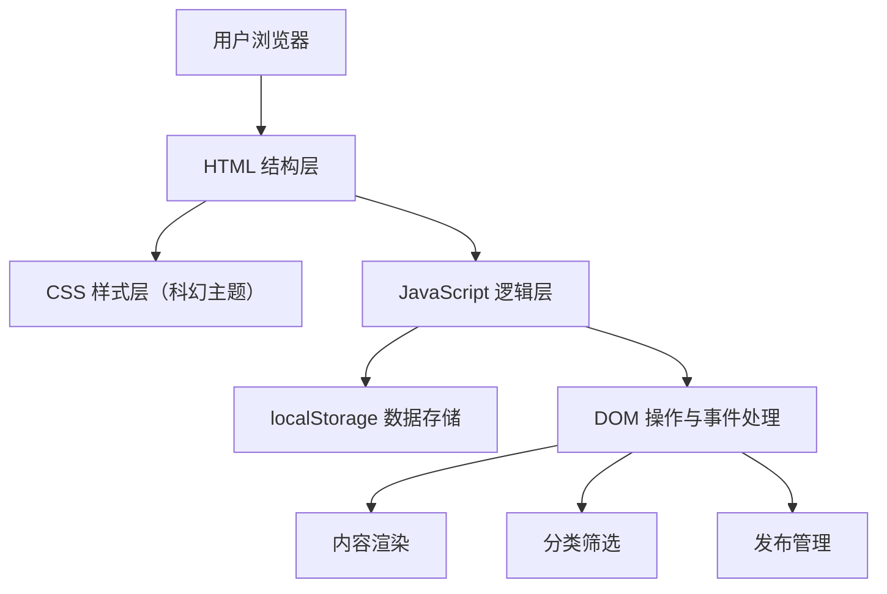

## 1. 架构设计

纯前端单页应用（SPA）架构，无需后端服务，所有数据存储在浏览器 localStorage 中。



## 2. 技术选型

- **前端**：纯原生 HTML5 + CSS3 + JavaScript（ES6+），零框架依赖
- **构建工具**：无构建工具，直接使用静态文件，完全零配置
- **后端**：无后端服务
- **数据库**：浏览器 localStorage（键值对存储，持久化不丢失）
- **部署**：可直接用任何静态托管服务（GitHub Pages、Vercel 等），或直接在浏览器打开

### 技术选型理由

| 技术 | 选择理由 |
|------|----------|
| 原生三件套 | 小白零压力，无需安装任何工具，直接编写 HTML/CSS/JS |
| localStorage | 无需数据库，浏览器自带，刷新不丢失，代码极其简单 |
| 无构建工具 | 省去 webpack/vite 等配置，一个 index.html 搞定一切 |
| 响应式 CSS | 纯 flexbox/grid 实现自适应，无额外依赖 |

## 3. 文件结构

```
/
├── index.html          # 主页面（全部内容在此文件）
├── style.css           # 全部样式（科幻主题风格）
└── script.js           # 全部逻辑（发布、存储、筛选、渲染）
```

极简的三文件结构，后续维护只需编辑这三个文件。

## 4. 数据模型

### 4.1 localStorage 数据格式

```javascript
// 存储键名
const STORAGE_KEY = 'deepspace_ideas';

// 数据结构
[
  {
    "id": "uuid-xxx",           // 唯一标识
    "title": "曲率引擎的燃料",    // 标题
    "content": "如果曲率引擎...", // 正文内容
    "category": "idea",         // 分类：idea（点子）/ concept（概念）/ essay（随笔）
    "createdAt": "2026-05-27T10:30:00.000Z"  // 发布时间 ISO 字符串
  }
]
```

### 4.2 数据操作接口

| 操作 | 方法 | 说明 |
|------|------|------|
| 读取全部 | localStorage.getItem(STORAGE_KEY) | 获取所有内容，解析 JSON |
| 新增内容 | push + setItem | 添加新条目并持久化 |
| 按分类筛选 | Array.filter() | 前端过滤，无需查询数据库 |

## 5. 路由设计

单页无路由模式，所有功能在同一页面完成：

| 视图状态 | 触发方式 | 说明 |
|----------|----------|------|
| 全部内容 | 默认 / 点击"全部" | 显示所有分类内容 |
| 点子视图 | 点击"科幻点子" | 只显示 idea 分类 |
| 概念视图 | 点击"科幻概念" | 只显示 concept 分类 |
| 随笔视图 | 点击"科幻随笔" | 只显示 essay 分类 |

## 6. 模块划分

### 6.1 CSS 模块

| 模块 | 说明 |
|------|------|
| 全局样式 | 深色背景、字体、滚动条、基础重置 |
| 导航栏 | 固定顶部、发光文字 logo、分类按钮组 |
| 发布表单 | 可折叠面板、发光输入框、分类选择器、发布按钮 |
| 卡片列表 | 网格布局、响应式列数 |
| 内容卡片 | 发光边框、悬浮动效、分类标签 |
| 空状态 | 无内容时的提示样式 |
| 动效 | 关键帧动画、过渡效果 |
| 响应式 | 媒体查询断点 |

### 6.2 JavaScript 模块

| 模块 | 函数/功能 | 说明 |
|------|-----------|------|
| 数据管理 | getIdeas(), saveIdeas() | localStorage 读写封装 |
| 内容发布 | handlePublish() | 获取表单数据、生成ID、保存、刷新列表 |
| 内容渲染 | renderIdeas() | 根据当前筛选条件渲染卡片 |
| 分类筛选 | filterIdeas() | 更新当前筛选条件，触发重新渲染 |
| 表单控制 | toggleForm() | 展开/收起发布表单 |
| 时间格式化 | formatDate() | 将 ISO 时间转为友好显示 |
| 初始化 | init() | 页面加载时的入口函数 |